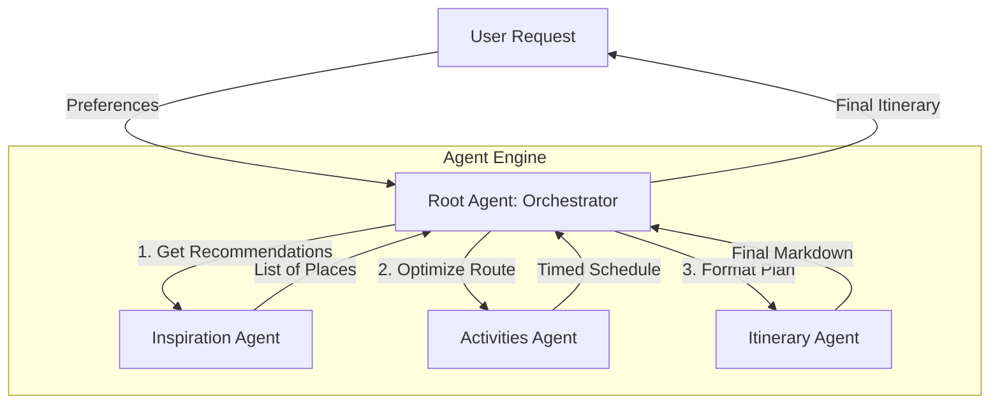

# 🌍 City Short Trip Planner

**An AI-powered multi-agent system that crafts personalized, logistics-optimized travel itineraries in seconds.**

## 1. Project Overview
The **City Short Trip Planner** is an intelligent travel assistant designed to solve the complexity of planning short city trips. Unlike generic travel tools or standard LLM prompts, this project leverages a **multi-agent architecture** where specialized AI agents collaborate to discover attractions, calculate optimal routes, and compose beautiful, day-by-day itineraries.

By orchestrating agents with distinct roles—inspiration, logistics, and content generation—this system delivers a travel plan that is not just creative but **logistically feasible**, taking into account real-world locations, opening hours, and travel times.

## 2. Problem Statement
Planning a short city trip is often overwhelming. Travelers struggle with:
*   **Information Overload**: Sifting through endless blogs and reviews to find "must-see" spots.
*   **Logistical Nightmares**: Figuring out the best order to visit places to minimize travel time.
*   **Generic Suggestions**: Getting cookie-cutter itineraries that don't match their specific interests (e.g., "hidden gems" vs. "tourist hotspots").
*   **Time Constraints**: Maximizing a limited 1-3 day window without feeling rushed.

A single LLM prompt often hallucinates locations or suggests physically impossible routes (e.g., jumping between distant districts instantly). Travelers need a solution that "thinks" like a local expert.

## 3. Solution Statement
Our solution is a **Multi-Agent System** powered by Google's Gemini models. Instead of relying on one monolithic model, we decompose the planning process into three distinct stages, handled by specialized agents:

1.  **Discovery**: Finding the right places based on user interests.
2.  **Logistics**: Validating locations and optimizing the route using real-world data.
3.  **Presentation**: Formatting the final output into a readable guide.

**Why Multi-Agent?**
*   **Specialization**: Each agent is optimized for a specific task (e.g., the Activities Agent focuses purely on routing logic, reducing hallucination).
*   **Tool Use**: Agents can independently call tools (like Google Search) to verify facts, ensuring the itinerary is up-to-date.
*   **Collaboration**: The output of one agent becomes the context for the next, creating a refined chain of thought that mimics a human travel agency's workflow.

## 4. Architecture & Agent Descriptions

The system follows a hierarchical **Orchestrator-Workers** pattern. The `Root Agent` acts as the manager, coordinating the flow of information between the user and the sub-agents.



**Text-Based Architecture Flow:**

1.  **User** sends a request (e.g., "3 days in Tokyo, love anime and food").
2.  **Root Agent** analyzes the request and starts the planning loop.
3.  **Step 1: Discovery**
    *   Root Agent calls -> **Inspiration Agent**.
    *   Inspiration Agent searches for top anime spots and restaurants -> returns list.
4.  **Step 2: Logistics**
    *   Root Agent calls -> **Activities Agent** with the list.
    *   Activities Agent calculates routes, travel times, and groups spots by proximity -> returns a timed schedule.
5.  **Step 3: Presentation**
    *   Root Agent calls -> **Itinerary Agent** with the schedule.
    *   Itinerary Agent writes the final engaging travel guide -> returns Markdown.
6.  **Root Agent** delivers the final itinerary to the **User**.

### 🤖 Agent Roles

#### 1. Root Agent (Orchestrator)
*   **Role**: The central brain of the system. It parses the user's request, maintains the session state, and calls sub-agents in a strict sequence.
*   **Responsibility**: Ensures the planning flow (Discovery -> Routing -> Formatting) is followed and handles errors or clarifications.

#### 2. Inspiration Agent (`inspiration_agent`)
*   **Role**: The "Local Guide".
*   **Responsibility**: Discovers attractions, hidden gems, and experiences that match the user's specific interests (e.g., "art museums," "vegan food").
*   **Tools**: `google_search` (to find current, highly-rated places).
*   **Interaction**: Receives user preferences -> Returns a curated list of candidate locations.

#### 3. Activities Agent (`activities_agent`)
*   **Role**: The "Logistics Manager".
*   **Responsibility**: Takes the list of places and determines the optimal visiting order. It calculates travel times, checks opening hours, and suggests transport modes (walking vs. public transit).
*   **Tools**: `google_search` (to check distances, routes, and operating hours).
*   **Interaction**: Receives list of places -> Returns a chronologically ordered schedule with travel details.

#### 4. Itinerary Agent (`itinerary_agent`)
*   **Role**: The "Travel Writer".
*   **Responsibility**: Transforms the dry logistical data into a warm, engaging, and easy-to-read itinerary. It adds tips, context, and formatting.
*   **Tools**: None (Pure generation based on context).
*   **Interaction**: Receives schedule data -> Returns the final polished Markdown itinerary.

## 5. Agent Deployment (Vertex AI Agent Engine)

This project is designed to be deployed to **Vertex AI Agent Engine**, a managed service for building and deploying reasoning agents. We use the **Agent Development Kit (ADK)** CLI to deploy the agent directly from our source code.

### Deployment Evidence
The agents are packaged and deployed as a reasoning engine on Google Cloud Vertex AI.

### Deployment Steps

**1. Prerequisites**
*   Google Cloud Project created and billing enabled.
*   `gcloud` CLI installed and authenticated (`gcloud auth login`).
*   **Agent Development Kit (ADK)** installed:
    ```bash
    pip install google-adk
    ```
*   A Cloud Storage bucket for staging artifacts (e.g., `gs://my-staging-bucket`).

**2. Deploy to Agent Engine**
Run the following `adk` command in the project root. This command packages your local agent code, builds the container, and deploys it to the managed service.

```bash
adk deploy agent_engine \
  --project=YOUR_PROJECT_ID \
  --region=us-central1 \
  --staging_bucket=gs://YOUR_STAGING_BUCKET \
  --display_name="City Short Trip Planner" \
  .
```

*   `--project`: Your Google Cloud Project ID.
*   `--staging_bucket`: The GCS bucket where build artifacts are stored.
*   `.`: Specifies the current directory as the source.

**3. Verification**
After the deployment completes (it may take a few minutes), you will see a resource name for your deployed agent:

```text
Resource Name: projects/123456789/locations/us-central1/reasoningEngines/987654321
```

You can verify the deployment in the Google Cloud Console under **Vertex AI > Agents**.

*(Place screenshot of Vertex AI Agent Engine Console here)*

## 6. Setup & Running Instructions

### Local Development
To run the project locally, you need Python 3.10+ and a Google Cloud Project with Vertex AI enabled.

1.  **Clone the repository**:
    ```bash
    git clone <repo-url>
    cd city-short-trip-planner
    ```

2.  **Install dependencies**:
    ```bash
    pip install -r requirements.txt
    ```

3.  **Set up Environment Variables**:
    Create a `.env` file in the root directory:
    ```env
    GOOGLE_API_KEY=your_gemini_api_key
    PROJECT_ID=your_gcp_project_id
    ```

4.  **Run the Backend (Agent Engine)**:
    ```bash
    uvicorn main:app --reload --port 8000
    ```

5.  **Run the Frontend (UI)**:
    ```bash
    streamlit run streamlit_ui.py
    ```

6.  **Access the App**:
    Open your browser to `http://localhost:8501`.

## 7. The Build

### Development Journey
Building this multi-agent system presented unique challenges in **prompt engineering** and **state management**.
*   **Challenge**: Preventing the "Inspiration Agent" from suggesting too many places that the "Activities Agent" couldn't fit into a single day.
*   **Solution**: We refined the system instructions to enforce a "budget" of 4-5 key locations per day.
*   **Tech Stack**:
    *   **Framework**: Google ADK (Agent Development Kit) for agent definitions.
    *   **LLM**: Gemini 2.5 Flash (chosen for speed and reasoning capability).
    *   **Backend**: FastAPI (high-performance async Python web framework).
    *   **Frontend**: Streamlit (for rapid, interactive UI prototyping).
    *   **Deployment**: Vertex AI Agent Engine (Managed Reasoning Engine).

### Key Decisions
*   **Hierarchical vs. Flat**: We chose a hierarchical structure (Root -> Sub-agents) to maintain strict control over the itinerary quality. A flat "chat" structure often led to disorganized plans.
*   **Agent Engine Deployment**: We utilized the `adk deploy agent_engine` command to deploy the agent as a managed resource on Vertex AI, simplifying the lifecycle management compared to raw container deployment.

## 8. Value Statement & Conclusion
The **City Short Trip Planner** demonstrates the transformative potential of **Agentic AI**. By moving beyond simple text generation to **active reasoning and tool use**, we turn a stressful planning process into a delightful experience.

This project proves that agents can be reliable, context-aware, and capable of handling complex, multi-step real-world tasks. It’s not just a travel planner; it’s a blueprint for the future of personalized digital assistants.
